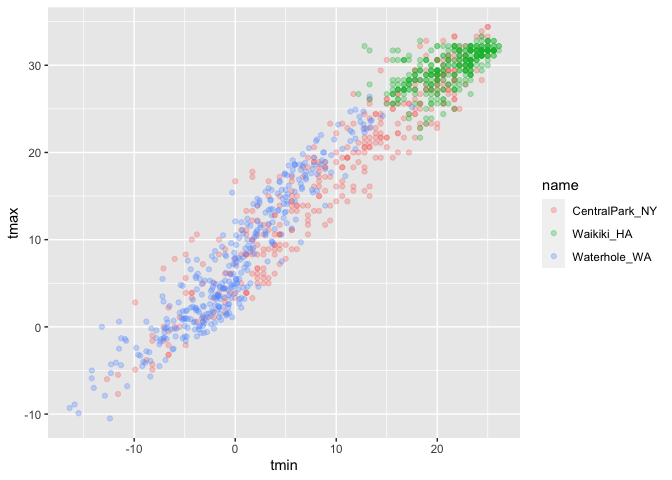
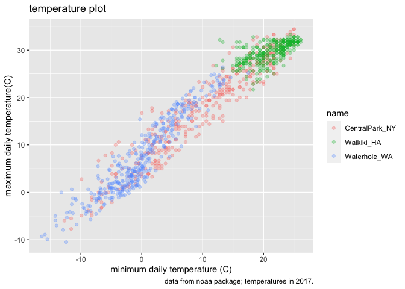
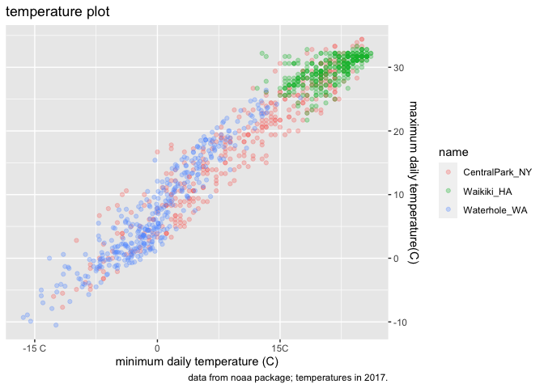
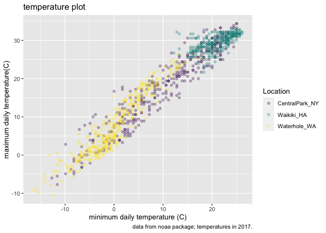
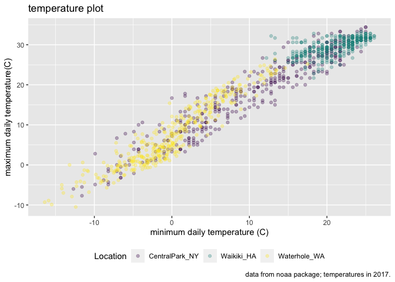
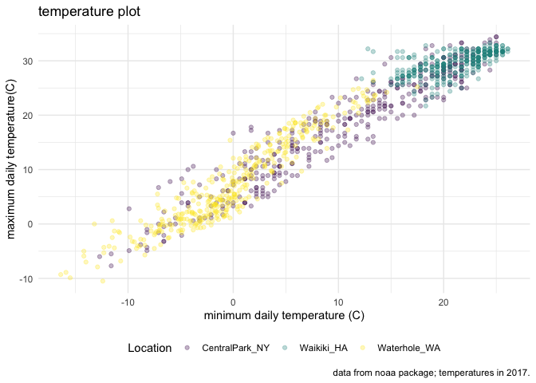
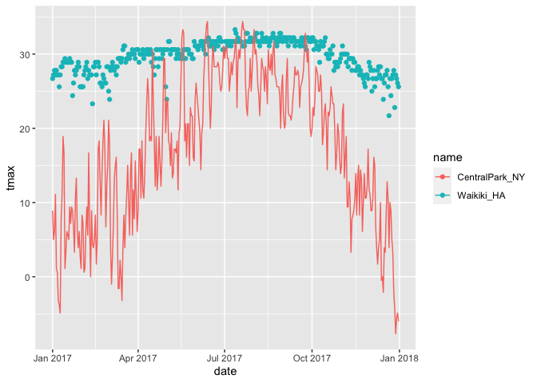
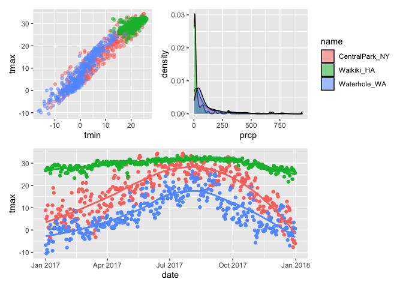
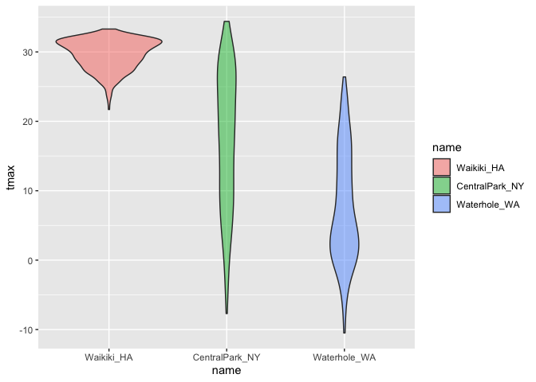
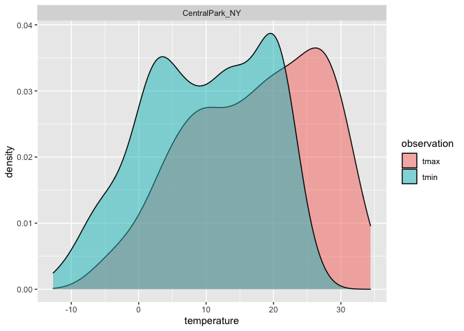

viz\_part2
================
Huili Zheng
10/5/2021

``` r
library(tidyverse)
```

    ## ── Attaching packages ─────────────────────────────────────── tidyverse 1.3.1 ──

    ## ✓ ggplot2 3.3.5     ✓ purrr   0.3.4
    ## ✓ tibble  3.1.4     ✓ dplyr   1.0.7
    ## ✓ tidyr   1.1.3     ✓ stringr 1.4.0
    ## ✓ readr   2.0.1     ✓ forcats 0.5.1

    ## ── Conflicts ────────────────────────────────────────── tidyverse_conflicts() ──
    ## x dplyr::filter() masks stats::filter()
    ## x dplyr::lag()    masks stats::lag()

``` r
library(patchwork)
```

Load a dataset that we will use.

``` r
weather_df = 
  rnoaa::meteo_pull_monitors(
    c("USW00094728", "USC00519397", "USS0023B17S"),
    var = c("PRCP", "TMIN", "TMAX"), 
    date_min = "2017-01-01",
    date_max = "2017-12-31") %>%
  mutate(
    name = recode(
      id, 
      USW00094728 = "CentralPark_NY", 
      USC00519397 = "Waikiki_HA",
      USS0023B17S = "Waterhole_WA"),
    tmin = tmin / 10,
    tmax = tmax / 10) %>%
  select(name, id, everything())
```

    ## Registered S3 method overwritten by 'hoardr':
    ##   method           from
    ##   print.cache_info httr

    ## using cached file: ~/Library/Caches/R/noaa_ghcnd/USW00094728.dly

    ## date created (size, mb): 2021-10-05 10:30:32 (7.602)

    ## file min/max dates: 1869-01-01 / 2021-10-31

    ## using cached file: ~/Library/Caches/R/noaa_ghcnd/USC00519397.dly

    ## date created (size, mb): 2021-10-05 10:30:38 (1.697)

    ## file min/max dates: 1965-01-01 / 2020-02-29

    ## using cached file: ~/Library/Caches/R/noaa_ghcnd/USS0023B17S.dly

    ## date created (size, mb): 2021-10-05 10:30:40 (0.912)

    ## file min/max dates: 1999-09-01 / 2021-09-30

## remember this plot …?

``` r
weather_df %>%
  ggplot(aes(x = tmin, y = tmax, color = name)) +
  geom_point(alpha = .3)
```

    ## Warning: Removed 15 rows containing missing values (geom_point).

<!-- -->

## lables

``` r
weather_df %>%
  ggplot(aes(x = tmin, y = tmax, color = name)) +
  geom_point(alpha = .3) +
  labs(
    title = "temperature plot",
    x = "minimum daily temperature (C)",
    y = "maximum daily temperature(C)",
    caption = "data from noaa package; temperatures in 2017."
  )
```

    ## Warning: Removed 15 rows containing missing values (geom_point).

<!-- -->

## sclae

start with the same plot; x and y scales.

``` r
weather_df %>%
  ggplot(aes(x = tmin, y = tmax, color = name)) +
  geom_point(alpha = .3) +
  labs(
    title = "temperature plot",
    x = "minimum daily temperature (C)",
    y = "maximum daily temperature(C)",
    caption = "data from noaa package; temperatures in 2017."
  ) +
  scale_x_continuous(
    breaks = c(-15, 0 ,15) ,
    labels = c("-15 C","0","15C")
  ) +
  scale_y_continuous(
    position = "right"
  )
```

    ## Warning: Removed 15 rows containing missing values (geom_point).

<!-- -->

look at color sclales

``` r
weather_df %>%
  ggplot(aes(x = tmin, y = tmax, color = name)) +
  geom_point(alpha = .3) +
  labs(
    title = "temperature plot",
    x = "minimum daily temperature (C)",
    y = "maximum daily temperature(C)",
    caption = "data from noaa package; temperatures in 2017."
  ) +
  scale_color_hue(
    name = "Location",
    h = c(100,300) )
```

    ## Warning: Removed 15 rows containing missing values (geom_point).

<!-- -->

``` r
weather_df %>%
  ggplot(aes(x = tmin, y = tmax, color = name)) +
  geom_point(alpha = .3) +
  labs(
    title = "temperature plot",
    x = "minimum daily temperature (C)",
    y = "maximum daily temperature(C)",
    caption = "data from noaa package; temperatures in 2017."
  ) +
  viridis::scale_color_viridis(
    name = "Location",
    discrete = TRUE)
```

    ## Warning: Removed 15 rows containing missing values (geom_point).

<!-- -->

## themes

shift the legend.

``` r
weather_df %>%
  ggplot(aes(x = tmin, y = tmax, color = name)) +
  geom_point(alpha = .3) +
  labs(
    title = "temperature plot",
    x = "minimum daily temperature (C)",
    y = "maximum daily temperature(C)",
    caption = "data from noaa package; temperatures in 2017."
  ) +
  viridis::scale_color_viridis(
    name = "Location",
    discrete = TRUE) +
  theme(legend.position = "bottom")
```

    ## Warning: Removed 15 rows containing missing values (geom_point).

<!-- -->

changethe overall themes.

``` r
weather_df %>%
  ggplot(aes(x = tmin, y = tmax, color = name)) +
  geom_point(alpha = .3) +
  labs(
    title = "temperature plot",
    x = "minimum daily temperature (C)",
    y = "maximum daily temperature(C)",
    caption = "data from noaa package; temperatures in 2017."
  ) +
  viridis::scale_color_viridis(
    name = "Location",
    discrete = TRUE) +
  theme_minimal() +       #ggthemes::theme_excel()
  theme(legend.position = "bottom")
```

    ## Warning: Removed 15 rows containing missing values (geom_point).

<!-- -->

## setting options

``` r
library(tidyverse)

knitr::opys_chunk$set(
  fig.width = 6,
  fig.asp = .6,
  out.width = "90%"
)

theme_set(theme_minimal() + theme(legend.position = "bottom"))

options(
  ggplot2.continuous.color = "viridis",
  ggplot2.continuous.fill = "viridis"
)

scale_color_discrete = scale_color_viridis_d
scale_fill_discrete = scale_fill_viridis_d
```

## data args in `geom`

``` r
central_park = 
  weather_df %>%
  filter(name == "CentralPark_NY")

waikiki = 
  weather_df %>%
  filter(name == "Waikiki_HA")

ggplot(data = waikiki, aes(x = date, y = tmax, color = name)) +
  geom_point() +
  geom_line(data = central_park)
```

    ## Warning: Removed 3 rows containing missing values (geom_point).

<!-- -->

## `patchwork`

remember faceting?

``` r
weather_df  %>%
  ggplot(aes(x = tmin, fill = name)) +
  geom_density(alpha = .5) +
  facet_grid(. ~ name)
```

    ## Warning: Removed 15 rows containing non-finite values (stat_density).

<!-- -->

what happens when you wnat multipanel plots but can’t facet …?

``` r
tmax_tmin_p = weather_df %>%
  ggplot(aes(x = tmin, y = tmax, color = name)) +
  geom_point(alpha = .5) +
  theme(legend.position = "none")

prcp_dens_p = 
  weather_df %>%
  filter(prcp > 0) %>%
  ggplot(aes(x = prcp, fill = name)) + 
  geom_density(alpha = .5)

tmax_date_p =
  weather_df %>%
  ggplot(aes(x = date, y = tmax, color = name)) +
  geom_point() +
  geom_smooth(se = FALSE) +
  theme(legend.position = "none")

(tmax_tmin_p + prcp_dens_p ) / tmax_date_p
```

    ## Warning: Removed 15 rows containing missing values (geom_point).

    ## `geom_smooth()` using method = 'loess' and formula 'y ~ x'

    ## Warning: Removed 3 rows containing non-finite values (stat_smooth).

    ## Warning: Removed 3 rows containing missing values (geom_point).

<!-- -->

## data manipulation

Control the factors.

``` r
weather_df %>%
  mutate(
    name = factor(name),
    name = forcats::fct_relevel(name, c("Waikiki_HA"))  ##Manipulate by the mean reorder 
  ) %>%
  ggplot(aes(x = name,  y = tmax, fill = name)) +
  geom_violin(alpha = .5)
```

    ## Warning: Removed 3 rows containing non-finite values (stat_ydensity).

<!-- -->

what if i wanted densitites for tmin and tmax simultaneously?

``` r
weather_df  %>%
  filter(name == "CentralPark_NY") %>%
  pivot_longer(
    tmax:tmin,
    names_to = "observation",
    values_to = "temperature"
  ) %>%
  ggplot(aes(x = temperature, fill = observation)) +
  geom_density(alpha = .5) +
  facet_grid(. ~name)
```

<!-- -->
